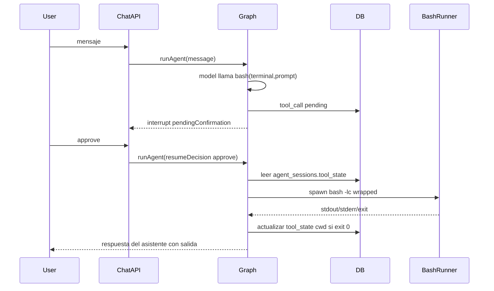

# Plan: herramienta `bash` (servidor Node)

## Contexto del repo

- Las herramientas se declaran en `[packages/agent/src/tools/catalog.ts](packages/agent/src/tools/catalog.ts)` y se implementan en `[packages/agent/src/tools/adapters.ts](packages/agent/src/tools/adapters.ts)` con `tool()` + Zod.
- `risk === "high"` implica confirmación: `[toolRequiresConfirmation](packages/agent/src/tools/catalog.ts)` + nodo `toolExecutorNode` con `interrupt()` en `[packages/agent/src/graph.ts](packages/agent/src/graph.ts)` (aprobar/rechazar vía `runAgent({ resumeDecision })`).
- Los toggles de usuario están en `[apps/web/src/app/settings/settings-form.tsx](apps/web/src/app/settings/settings-form.tsx)` (`TOOL_IDS` + upsert a `user_tool_settings`).

## Semántica acordada

- **Ejecución**: proceso Node del servidor (`spawn` / `execFile`), no Terminal.app del usuario.
- **Inputs**: `terminal` (string, id lógico, p. ej. `"default"` o `"frontend"`), `prompt` (string: comando o script bash a ejecutar en esa sesión lógica).
- **“Abrir o crear terminal”**: si no hay estado guardado para `(sessionId, terminal)`, usar un directorio inicial configurable; si existe, usar el `cwd` persistido.
- **Output**: string (JSON con campos claros: `stdout`, `stderr`, `exit_code`, opcionalmente `cwd` final) para alinearse con el resto de herramientas que devuelven JSON stringificado.

## Persistencia del `cwd` (necesario tras HITL)

Tras aprobar, `runAgent` se invoca de nuevo; un `Map` en memoria **no** conserva el estado entre peticiones. Por tanto:

1. **Migración Supabase**: añadir columna `tool_state jsonb not null default '{}'` a `public.agent_sessions` (nuevo archivo bajo `[packages/db/supabase/migrations/](packages/db/supabase/migrations/)`).
2. **Tipo**: extender `[AgentSession](packages/types/src/index.ts)` con `tool_state?: Record<string, unknown>` (o estructura mínima tipada solo donde se use).
3. **Queries**: en `[packages/db/src/queries/sessions.ts](packages/db/src/queries/sessions.ts)` añadir funciones pequeñas, por ejemplo `getSessionToolState` / `updateBashTerminalCwd` que lean/actualicen `tool_state.bash.terminals[terminalId].cwd` con merge seguro (no pisar otras claves de `tool_state`).

**Detección del cwd tras el comando**: envolver la orden del usuario en un script que, al final, emita una línea marcador única por invocación (p. ej. UUID + `__BASH_TOOL_PWD__`) seguida de `pwd`, parsear esa línea en el runner y **eliminarla** del output devuelto al modelo; actualizar `tool_state` con el nuevo `cwd` si el comando termina con éxito (criterio explícito: solo actualizar si `exit_code === 0`, para no arrastrar `cd` fallido).

## Implementación del runner

- Nuevo módulo pequeño, p. ej. `[packages/agent/src/tools/bash-runner.ts](packages/agent/src/tools/bash-runner.ts)` (o equivalente), que:
  - Resuelva `cwd` inicial: valor en `tool_state` o `process.env.AGENT_BASH_INITIAL_CWD` o `process.cwd()`.
  - Ejecute con `spawn("bash", ["-lc", wrappedScript], { cwd, env: process.env, timeout })`.
  - Límites: timeout (p. ej. 30s por defecto, override por env) y tope de bytes en stdout+stderr (truncar y anotar en JSON).
  - Opcional pero recomendable: si `AGENT_BASH_DISABLED === "true"`, devolver error claro sin ejecutar (útil en producción).

## Cableado en el agente

1. **Catálogo**: entrada `bash` con `risk: "high"` y `parameters_schema` (`terminal`, `prompt` requeridos) y la descripción en español que indicaste.
2. **Adapters**: bloque `isToolAvailable("bash", ctx)` que:
  - Opcionalmente registre la llamada en `tool_calls` como hacen otras herramientas de lectura (coherente con auditoría); para HITL, el grafo ya crea el registro pendiente — evitar duplicar lógica: ejecutar solo el runner tras aprobación (igual que `get_user_preferences` no duplica en el path interrupt; revisar si quieres `createToolCall` solo en ejecución; lo mínimo es devolver JSON como las demás).
3. **Mensaje de confirmación**: en `[buildConfirmationMessage](packages/agent/src/graph.ts)`, caso `bash` que muestre `terminal` y un preview acortado de `prompt` (evitar fugas enormes).

## UI / onboarding

- Añadir `bash` a `TOOL_IDS` en `[settings-form.tsx](apps/web/src/app/settings/settings-form.tsx)`.
- Si quieres paridad con onboarding: añadir entrada en `[step-tools.tsx](apps/web/src/app/onboarding/steps/step-tools.tsx)` (riesgo alto, sin integración) y incluir `bash` en el array `TOOL_IDS` del `[wizard.tsx](apps/web/src/app/onboarding/wizard.tsx)` al hacer upsert final (si no, los usuarios solo podrán activarlo desde Ajustes).

## Diagrama de flujo (riesgo alto)

## Riesgos y límites (a documentar en comentarios o README solo si lo pides)

- Ejecuta con los permisos del proceso del servidor (clave service role ya existe para DB; bash es aún más sensible).
- En despliegues serverless, el filesystem puede ser efímero; el valor está en automatización controlada por HITL, no en “la Mac del usuario”.

