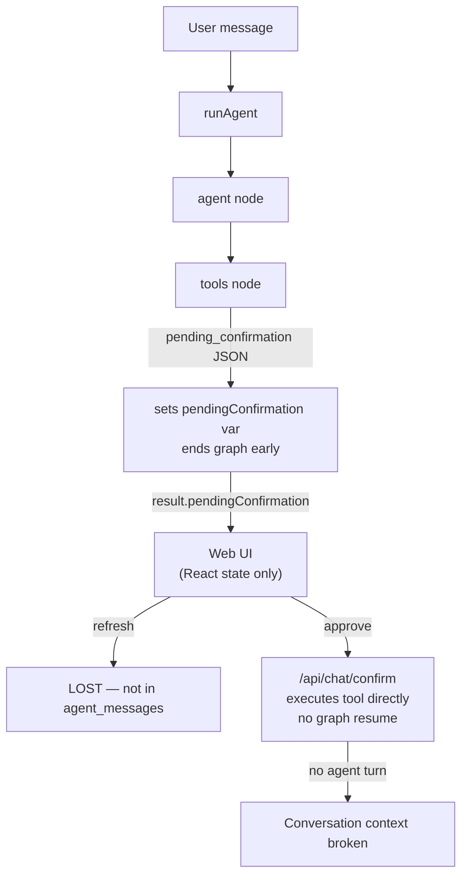
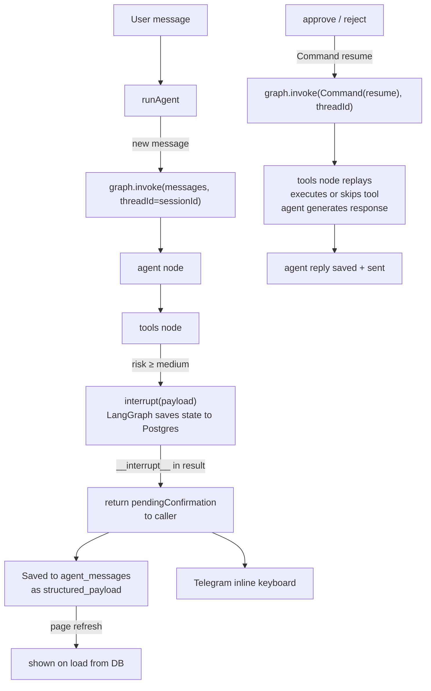

# LangGraph HITL Layer Plan

## Current architecture (and why it breaks)




The `pendingConfirmation` only lives in React state (not DB) and the tool is executed outside the graph, so the agent never sees the result.

## New architecture




## Key files changed

- `[packages/agent/package.json](packages/agent/package.json)` — add `@langchain/langgraph-checkpoint-postgres`
- `[packages/agent/src/checkpointer.ts](packages/agent/src/checkpointer.ts)` — new: singleton `PostgresSaver` factory
- `[packages/agent/src/graph.ts](packages/agent/src/graph.ts)` — core changes (interrupt, resume, Postgres checkpointer)
- `[packages/agent/src/tools/withTracking.ts](packages/agent/src/tools/withTracking.ts)` — remove `pending_confirmation` JSON, keep DB tracking
- `[packages/db/src/queries/tool-calls.ts](packages/db/src/queries/tool-calls.ts)` — add `findExistingPendingToolCall` (idempotency)
- `[apps/web/src/app/api/chat/confirm/route.ts](apps/web/src/app/api/chat/confirm/route.ts)` — call `runAgent({ resumeDecision })` instead of direct tool execution
- `[apps/web/src/app/chat/page.tsx](apps/web/src/app/chat/page.tsx)` — query `tool_calls` for pending items on load
- `[apps/web/src/app/chat/chat-interface.tsx](apps/web/src/app/chat/chat-interface.tsx)` — accept `initialPendingConfirmation` prop
- `[apps/web/src/app/api/telegram/webhook/route.ts](apps/web/src/app/api/telegram/webhook/route.ts)` — resume graph on callback_query, send agent response

## Step-by-step changes

### 1. Install Postgres checkpointer

```
npm install @langchain/langgraph-checkpoint-postgres --workspace=packages/agent
```

Requires `DATABASE_URL` env var (Supabase Postgres direct connection URL).

### 2. `packages/agent/src/checkpointer.ts` (new file)

Singleton `PostgresSaver` that calls `setup()` once to create LangGraph checkpoint tables:

```typescript
import { PostgresSaver } from "@langchain/langgraph-checkpoint-postgres";
let _saver: PostgresSaver | null = null;
export async function getCheckpointer() {
  if (!_saver) {
    _saver = PostgresSaver.fromConnString(process.env.DATABASE_URL!);
    await _saver.setup();
  }
  return _saver;
}
```

### 3. `packages/agent/src/graph.ts` — interrupt-based HITL

Key changes:

- **Remove** `pendingConfirmation` outer variable and the `shouldContinue` shortcut
- **In `toolExecutorNode`**, before executing a risky tool:
  1. Look up or create a `tool_calls` DB record (idempotent via `findExistingPendingToolCall`)
  2. Call `interrupt({ tool_call_id, tool_name, message, args })` — graph pauses, state saved
  3. On resume, `interrupt()` returns `'approve' | 'reject'`; branch accordingly
- `**runAgent` API change** — add optional `resumeDecision`:

```typescript
export interface AgentInput {
  // existing fields...
  resumeDecision?: 'approve' | 'reject';   // new
}
```

- When `resumeDecision` is set, call:

```typescript
  await app.invoke(new Command({ resume: resumeDecision }), config)
  

```

  instead of invoking with a new message.

- Detect `__interrupt__` in the result and return it as `pendingConfirmation`.
- Save `pendingConfirmation` payload to `agent_messages` with `structured_payload` so it survives refresh.
- Replace `new MemorySaver()` with `await getCheckpointer()`.

### 4. `packages/agent/src/tools/withTracking.ts`

Remove the `if (needsConfirm) { return JSON.stringify({ pending_confirmation: true, ... }) }` branch. The interrupt is now handled in `toolExecutorNode`. `withTracking` only creates the DB record and tracks execution status for non-HITL tools.

### 5. `packages/db/src/queries/tool-calls.ts`

Add:

```typescript
export async function findExistingPendingToolCall(
  db: DbClient, sessionId: string, toolName: string
): Promise<ToolCall | null>
```

Used in `toolExecutorNode` to avoid duplicate records when the node replays after resume.

### 6. `apps/web/src/app/api/chat/confirm/route.ts`

Replace direct `executeGitHubTool` call with:

```typescript
const result = await runAgent({
  resumeDecision: action === 'approve' ? 'approve' : 'reject',
  sessionId: toolCall.session_id,
  userId: user.id,
  // ... other context rebuilt from session
});
return NextResponse.json({ ok: true, response: result.response });
```

The agent then sees the tool result and generates a proper continuation reply.

### 7. `apps/web/src/app/chat/page.tsx`

After loading `sessionMessages`, also query:

```typescript
const { data: pendingToolCalls } = await supabase
  .from("tool_calls")
  .select("*")
  .eq("session_id", currentSession.id)
  .eq("status", "pending_confirmation")
  .order("created_at", { ascending: false })
  .limit(1);
const initialPendingConfirmation = pendingToolCalls?.[0] ?? null;
```

Pass `initialPendingConfirmation` to `<ChatInterface>`.

### 8. `apps/web/src/app/chat/chat-interface.tsx`

Accept `initialPendingConfirmation` prop and merge it into the initial `messages` state as a confirmation-type message, so it renders with approve/reject buttons immediately on load.

### 9. `apps/web/src/app/api/telegram/webhook/route.ts`

In the `callback_query` handler (approve/reject):

- Look up `toolCall.session_id` → load user/tools/integrations context
- Call `runAgent({ resumeDecision: action, sessionId, userId, ... })`
- Send `result.response` as a Telegram message (the agent's reply after tool execution)
- Remove the direct `executeGitHubTool` call

### 10. `CONFIRMATION_MESSAGES` in `adapters.ts`

Keep as-is — these provide human-readable descriptions passed into the interrupt payload.

## Risk-field integration (no changes needed to catalog)

`toolRequiresConfirmation` from `packages/types/src/catalog.ts` already drives the decision — `risk: "medium" | "high"` → interrupt. This is the single source of truth; adding a new tool with `risk: "medium"` will automatically get HITL with no other changes.

## Environment variable requirement

`DATABASE_URL` must be set to the Supabase Postgres direct connection string (not the pooler URL, since LangGraph checkpointing uses advisory locks that require a direct connection). This is separate from the `SUPABASE_*` env vars used by the Supabase JS client.

## One-time migration

`PostgresSaver.setup()` creates 3 LangGraph checkpoint tables in your Postgres DB on first run (idempotent). No SQL migration file is needed.