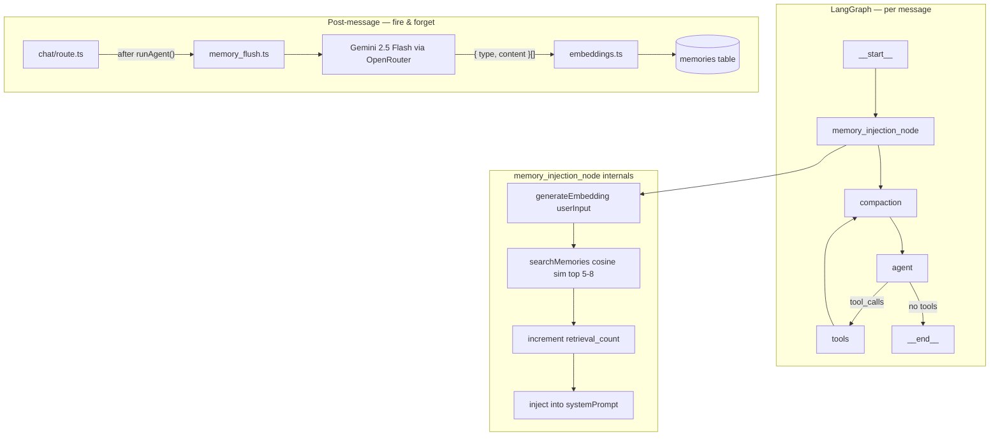

---

**Contexto del sistema actual**

- **Sesiones:** actualmente independientes — no hay continuidad entre ellas. El `sessionId` existe pero no se cruza entre sesiones del mismo usuario

- **Grafo actual:**
```
__start__ → compaction → agent → (conditional) → tools → compaction → agent → ... → __end__
```
- el `userId` debe ser el identificador para cruzar recuerdos entre sesiones

---

**Lo que hay que construir**

**1. Tabla nueva en Supabase — `memories`:**
```sql
id, user_id, type (episodic|semantic|procedural),
content (text), embedding (vector 1536),
retrieval_count (int, default 0),
created_at, last_retrieved_at
```

**2. `memory_flush.ts` — extracción post-sesión:**
- Recibe el historial completo de la sesión terminada
- Llama a Haiku con prompt estructurado para extraer hechos en JSON: `{ type, content }[]`
- Genera embeddings para cada recuerdo
- Inserta en tabla `memories` de Supabase
- Se dispara desde fuera del grafo — cuando la sesión cierra, no dentro del loop del agente

**3. `memory_injection_node.ts` — nuevo nodo en el grafo:**
- Recibe `userInput` y `userId`
- Genera embedding del input actual
- Busca en Supabase por cosine similarity — top 5-8 recuerdos
- Incrementa `retrieval_count` de los encontrados
- Inyecta los recuerdos al `systemPrompt` como bloque `[MEMORIA DEL USUARIO]`
- Retorna `Partial<GraphState>` con el systemPrompt enriquecido

**4. Actualizar el grafo:**
```
__start__ → memory_injection → compaction → agent → tools → compaction → ...
```

**Lo que NO se toca:** `compaction_node`, `agent_node`, `toolExecutorNode`, HITL, checkpointer, `iterationCount`
```


---

# Plan

---
name: Long-Term Memory System
overview: "Add long-term memory to the agent via two separate processes: a post-session `memory_flush` that extracts memories from conversation history and stores them in Supabase with pgvector embeddings, and a `memory_injection_node` that retrieves the most relevant memories at the start of each session and injects them into the system prompt."
todos:
  - id: sql-migration
    content: Create SQL migration for `memories` table with pgvector index in Supabase
    status: pending
  - id: db-memories-queries
    content: Create packages/db/src/queries/memories.ts with saveMemory, searchMemories, incrementRetrievalCount; export from index.ts
    status: pending
  - id: embeddings-ts
    content: Create packages/agent/src/embeddings.ts with generateEmbedding() via OpenRouter fetch
    status: pending
  - id: memory-injection-node
    content: Create packages/agent/src/nodes/memory_injection_node.ts factory
    status: pending
  - id: memory-flush
    content: Create packages/agent/src/memory_flush.ts with flushSessionMemory()
    status: pending
  - id: graph-update
    content: Update packages/agent/src/graph.ts to add memory_injection node at __start__
    status: pending
  - id: agent-index-export
    content: Export flushSessionMemory from packages/agent/src/index.ts
    status: pending
  - id: chat-route-flush
    content: Add fire-and-forget flushSessionMemory call in apps/web/src/app/api/chat/route.ts
    status: pending
isProject: false
---

# Long-Term Memory System

## Architecture




## Files to create

### 1. SQL migration — `memories` table

Run in Supabase SQL editor (not a code file):

```sql
CREATE EXTENSION IF NOT EXISTS vector;

CREATE TABLE memories (
  id              UUID        PRIMARY KEY DEFAULT gen_random_uuid(),
  user_id         UUID        NOT NULL REFERENCES auth.users(id) ON DELETE CASCADE,
  type            TEXT        NOT NULL CHECK (type IN ('episodic','semantic','procedural')),
  content         TEXT        NOT NULL,
  embedding       vector(1536),
  retrieval_count INT         NOT NULL DEFAULT 0,
  created_at      TIMESTAMPTZ NOT NULL DEFAULT NOW(),
  last_retrieved_at TIMESTAMPTZ
);

CREATE INDEX ON memories USING ivfflat (embedding vector_cosine_ops)
  WITH (lists = 100);
```

### 2. `[packages/db/src/queries/memories.ts](packages/db/src/queries/memories.ts)`

Three functions:

- `saveMemory(db, { userId, type, content, embedding })` — inserts a row
- `searchMemories(db, { userId, embedding, limit })` — cosine similarity via RPC/SQL, returns top N rows
- `incrementRetrievalCount(db, ids[])` — updates `retrieval_count` and `last_retrieved_at`

Re-export from `[packages/db/src/index.ts](packages/db/src/index.ts)`.

### 3. `[packages/agent/src/embeddings.ts](packages/agent/src/embeddings.ts)`

Single function `generateEmbedding(text: string): Promise<number[]>` — calls OpenRouter embeddings endpoint (`openai/text-embedding-3-small`, 1536 dims) using `fetch` + `OPENROUTER_API_KEY`.

### 4. `[packages/agent/src/nodes/memory_injection_node.ts](packages/agent/src/nodes/memory_injection_node.ts)`

Factory: `createMemoryInjectionNode({ db, userId })` → returns async node function.

Node logic:

1. Find the first `HumanMessage` in `state.messages` — that is the current user input
2. Call `generateEmbedding(input)`
3. Call `searchMemories(db, { userId, embedding, limit: 8 })`
4. Call `incrementRetrievalCount(db, ids)`
5. If memories found, prepend a `[MEMORIA DEL USUARIO]` block to `state.systemPrompt`
6. Return `Partial<GraphState>` with updated `systemPrompt` (no message changes)

### 5. `[packages/agent/src/memory_flush.ts](packages/agent/src/memory_flush.ts)`

Exported function `flushSessionMemory({ db, userId, sessionId })`:

1. Load messages with `getSessionMessages(db, sessionId, 200)`
2. Format as transcript string
3. Call `ChatOpenAI` with model `anthropic/claude-haiku-3-5` (via OpenRouter) and a structured extraction prompt
4. Parse response as `{ type: 'episodic'|'semantic'|'procedural', content: string }[]`
5. For each item: `generateEmbedding(content)` then `saveMemory(...)`
6. Silent on parse failures (conservative — emit nothing if JSON is malformed)

Extraction prompt (conservative):

> "Extract only facts that will still be true in the next session. Classify each as episodic/semantic/procedural. Return a JSON array. If nothing is worth remembering, return []."

## Files to modify

### 6. `[packages/agent/src/graph.ts](packages/agent/src/graph.ts)`

- Import `createMemoryInjectionNode`
- Inside `runAgent`, create the node: `const memoryInjection = createMemoryInjectionNode({ db, userId })`
- Replace graph construction:

```
  __start__ → memory_injection → compaction → agent → tools → compaction → ...
  

```

  (i.e. `.addNode("memory_injection", memoryInjection)` + `.addEdge("__start__", "memory_injection")` + `.addEdge("memory_injection", "compaction")`)

### 7. `[packages/agent/src/index.ts](packages/agent/src/index.ts)`

- Add `export { flushSessionMemory } from "./memory_flush"`

### 8. `[apps/web/src/app/api/chat/route.ts](apps/web/src/app/api/chat/route.ts)`

- After `runAgent()` returns and **only if there is no `pendingConfirmation`** (i.e. normal completion), fire-and-forget:

```ts
  flushSessionMemory({ db, userId: user.id, sessionId: session.id }).catch(console.error);
  

```

- No `await` — does not block the response.

## What is NOT touched

`compaction_node.ts`, `agent_node`, `toolExecutorNode`, HITL interrupt logic, `getCheckpointer`, `iterationCount`, `GraphState` shape, all existing DB queries.